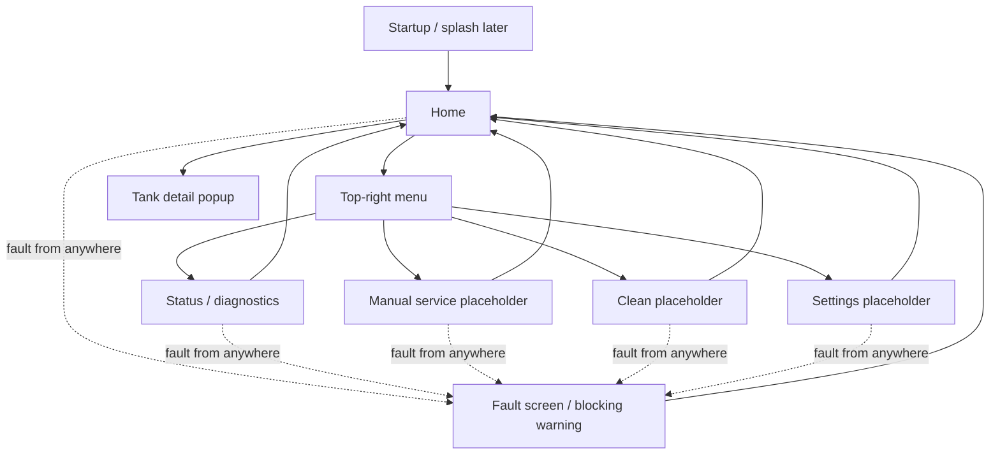
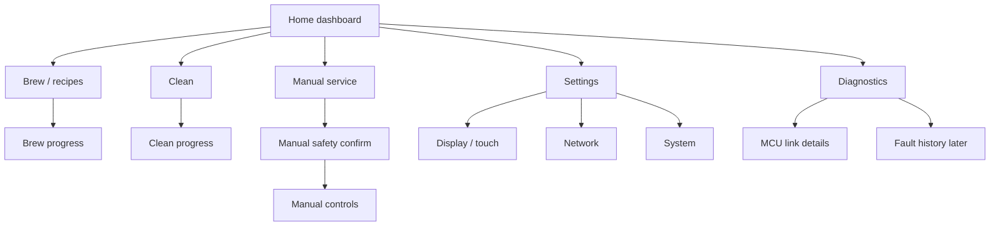

# FreeBrewie UI Navigation Mockups
_Date: 2026-07-03_

## Purpose
This document describes the first intended FreeBrewie screen flow.

It is not final artwork. It is a practical bridge between:
- the UI we want the user to experience
- the LVGL screens we will build
- the program structure needed to keep screen code, app logic, and hardware communication separate

The main UI design/spec document lives in the same UI design folder:

- `FreeBrewie_UI_Design_Spec_2026-07-03.html`

Open that file in a desktop browser to see the current navigation notes, palette, screen
roles, implementation checklist, and 272x480 portrait mockups close to the UI style we
should implement first.

The color direction intentionally borrows from the original Brewie UI:
- charcoal/black screen background
- warm orange primary actions, around `#f47b32`
- grey text for secondary information
- restrained accent colors for status and faults

---

## Design constraints
The real appliance display is small and portrait:

- logical UI size: 272x480
- physical LCD scanout: 480x272
- target display path: custom rotated DRM backend
- touch input: Goodix touchscreen through `/dev/input/event0`

The A13 SOM can handle the current rotated DRM path well when LVGL redraws only the parts of the screen that changed. Continuous full-screen redraws are visibly choppy. That affects UI design:

- prefer stable layouts where small values update in place
- prefer short fades, button presses, and local movement over whole-screen sliding
- avoid constantly animating large backgrounds
- keep touch targets large and clear
- keep text short enough for 272 pixel width
- keep the warm orange accent as the main product color unless hardware readability tests
  show that another color works better on the real panel

The UI can still feel good. It just needs to be designed for this hardware instead of pretending it is a modern phone.

---

## Current proven baseline
The current running app already proves:

- target LVGL portrait output works
- the custom rotated DRM backend works
- the MCU serial link works while the screen is active
- `STATUS_REPORT` frames are received
- touch reaches LVGL
- the portrait touch mapping is plausible
- LVGL button click events work
- heartbeat/status log spam has been reduced

The current `Screen_status` is still a debug/status screen. It should remain available, but it should not become the final home screen.

---

## Near-term navigation
The first real UI should be deliberately small.



First implementation target:

1. Add `Screen_home`.
2. Keep Home minimal, with a top-right menu for secondary destinations.
3. Let the menu navigate to the existing `Screen_status`.
4. Add placeholder screens for `Manual`, `Clean`, and `Settings`.
5. Keep the current touch proof only until the navigation buttons are proven.
6. Keep all hardware-affecting actions disabled until the app logic and MCU safety boundaries are ready.

---

## Later navigation direction
The old Brewie UI had a main menu with Home, Recipes, Extras, and Settings. That is useful inspiration, but the new UI should start from the appliance's current state rather than from a menu list.

The likely later shape is:



This later map is intentionally not the first implementation. It is here so we avoid painting ourselves into a corner.

---

## Home screen intent
The home screen should answer three questions immediately:

- Is the machine ready?
- Is the MCU connected?
- What can I safely do next?

Near-term home content:

```text
+--------------------------------+
| FreeBrewie              Ready  |
| MCU connected                  |
+--------------------------------+
| Mash            Boil           |
| 21.4 C          21.2 C         |
| target --       target --      |
+--------------------------------+
| [ Brew later ]                 |
| menu: Status / Clean / Manual  |
| tank tap: detail popup         |
+--------------------------------+
```

Near-term behavior:
- `Status` works from the top-right menu.
- `Clean`, `Manual`, and `Settings` open placeholder screens from the top-right menu.
- Mash and Boil summaries are tappable and open simple detail popups.
- `Brew later` remains disabled until workflow logic exists.
- Any fault should be more visually important than normal action buttons.

---

## Screen roles

### Startup / splash
Future role:
- short appliance identity screen during SOM boot or app start
- later can become animated
- should stay separate from `Screen_status`

Near-term implementation:
- no special startup animation yet
- app can start directly at `Home` after platform/comms/UI init

### Home
Role:
- normal user landing screen
- quick health summary
- safe entry points into workflows

Code direction:
- `Screen_home.c`
- `Screen_home.h`
- no direct serial/protocol code
- receives a compact view model from app logic

### Status / diagnostics
Role:
- developer/service visibility
- MCU link status
- raw-ish bring-up facts
- useful while the system is still being proven

Code direction:
- keep `Screen_status`
- remove temporary touch proof once home navigation is proven
- keep text wrapping because diagnostic values can be long

### Manual service
Role:
- later direct hardware service actions
- must be guarded by app logic and MCU interlocks

Near-term implementation:
- placeholder only
- no actuator controls yet

### Clean
Role:
- cleaning workflows
- old Brewie extras included short clean, sanitizing clean, full clean, drain, and unclogging

Near-term implementation:
- placeholder only
- list likely clean modes later, but do not start hardware actions yet

### Settings
Role:
- display, touch, network, system, and service settings

Near-term implementation:
- placeholder only
- useful first item later: touch/display calibration facts

### Fault
Role:
- interrupt normal navigation
- show clear, high-priority fault state
- make unsafe actions unavailable

Near-term implementation:
- can begin as a blocking warning screen or banner once fault logic is ready

---

## Program structure implications
The UI navigation should not be hard-coded as scattered button callbacks that directly manipulate hardware.

Preferred direction:

```text
App.c
    owns the main app context and update order

Logic/
    owns app state, view models, and the meaning of user actions

UI/
    owns screens, widgets, and navigation requests

Comms/
    owns serial transport, protocol frames, heartbeat, and latest MCU facts

Platform/
    owns display, touch, timing, and logging
```

Initial navigation can be simple, but it should still have a clear owner. A practical first shape is:

- UI buttons emit app-level actions such as `USER_ACTION_SHOW_STATUS`
- app logic decides whether the action is allowed
- the app coordinator switches screens
- hardware commands remain behind logic and comms boundaries

This keeps the future manual-service screen from becoming a dangerous pile of button callbacks.

---

## Implementation order
Recommended next implementation steps:

1. Add the `Screen_home` module.
2. Add a small navigation state in the app/UI layer.
3. Start on `Home` instead of directly on `Screen_status`.
4. Make the `Status` button show the existing diagnostics screen.
5. Add safe placeholder screens for `Manual`, `Clean`, and `Settings`.
6. Remove the temporary `Touch OK` proof button once normal navigation proves touch.
7. Add a fault banner or fault screen after the home/status navigation is stable.

This is intentionally modest. It gives us the first real product-shaped app without pretending that brewing, cleaning, or manual service are safe to control yet.
